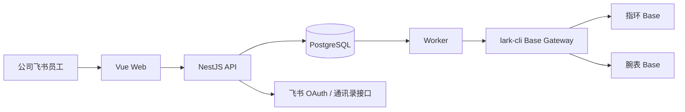

# 仓储领用与飞书库存同步 V1 技术设计

## 1. 设计目标

构建一套可部署的前后端仓储领用系统，以 PostgreSQL 保证整单业务事务、权限和待同步库存的即时一致性，以两套现有飞书多维表格中的标准化新表作为最终库存底账，并通过固定版本的官方 `lark-cli` 完成所有 Base 表结构、记录和附件操作。

设计必须同时满足：

- 正常领用先审核后发放，临时领用先出库后补手续，线下登记直接出库。
- 指环与腕表可在同一张单据混领，但只允许一个来源仓库并整单处理。
- 西湖仓、余杭仓独立核算；仓库管理员按仓授权，系统管理员默认全仓权限。
- 飞书暂时失败时不丢失已经发生的业务，不重复扣减，并向所有页面展示包含待同步变动后的准确可用库存。
- 旧飞书表、字段和历史数据全部保留，新系统只增加标准化新表、字段、视图和权限配置。

## 2. 技术栈与仓库结构

采用 pnpm 管理的 TypeScript 单仓库：

```text
apps/
  web/          Vue 3 + Vite + TypeScript + Vue Router + Pinia
  api/          NestJS REST API、飞书登录回调、业务事务
  worker/       NestJS standalone worker、提醒扫描、lark-cli 同步与对账
packages/
  contracts/    Zod 请求/响应/领域枚举与共享类型
  config/       环境变量校验和公共配置
  feishu-cli/   lark-cli 安全调用、JSON 解析、错误分类和脱敏日志
  database/     Prisma schema、迁移、种子和数据库客户端
```

- 数据库：PostgreSQL，负责本地业务事实、库存预占、待同步变动、审计与 outbox。
- ORM：Prisma，所有库存变动通过显式数据库事务和行级锁保护。
- 前端组件：Element Plus 用于管理端密集表格、表单和弹窗；移动扫码申领页使用同一组件体系的响应式布局。
- Excel：服务端生成包含 `领用单汇总` 与 `商品明细` 的 XLSX。
- 二维码：由后端按稳定仓库入口 URL 生成 PNG/SVG，二维码内容只含公开入口地址和仓库代码。
- V1 不引入 Redis；任务队列使用 PostgreSQL outbox 表和 `FOR UPDATE SKIP LOCKED` 竞争领取，API 与 worker 可独立部署和扩容。
- 当前验证过的 `lark-cli` 固定为 `1.0.91`；升级必须先在测试 Base 回归结构、记录、附件和身份参数。

## 3. 系统边界



- 飞书 OAuth、客户端免登、用户资料和离职事件由 API 通过飞书开放平台认证/通讯录接口处理，不通过 CLI。
- Base 表结构、库存余额、库存流水、产品附件和对账读取统一通过 `lark-cli base +...` 处理。
- 浏览器永远不持有 App Secret、CLI profile、Base token 或附件 file token。

## 4. 核心领域模型

### 4.1 身份与权限

- `users`：本地用户 ID、tenant key、飞书 user/open/union ID、姓名/头像/部门快照、在职状态、最后登录时间。
- `roles` / `user_roles`：`CLAIMANT`、`WAREHOUSE_ADMIN`、`SYSTEM_ADMIN`。
- `warehouse_admin_scopes`：仓库管理员与仓库的多对多授权。
- `audit_logs`：角色、授权、商品、库存、审核、发放、同步重试和配置变更的不可缺审计事件。

首次登录仅在 tenant key 和应用可用范围均合法时创建普通领用人。首位系统管理员初始化在数据库事务中校验“当前无系统管理员 + 配置租户 + 稳定飞书用户 ID”，成功一次后写入永久初始化事件。

### 4.2 仓库与商品

- `warehouses`：稳定代码 `XIHU`、`YUHANG`，名称、启用状态、公开入口 slug。
- `product_categories`：`SMART_RING`、`SMART_WATCH`。
- `products`：稳定产品 ID、正式名称、类别、规格模式、状态、目标 Base、飞书产品记录 ID、图片同步版本。
- `product_aliases`：历史名称到稳定产品 ID 的显式映射。
- `product_variants`：产品 + 可选尺码；指环尺码为 6# 至 13#，腕表尺码恒为 `NULL`。
- `product_image_refs`：飞书附件 token、主图/详情图、排序和最后刷新时间的本地镜像；飞书附件字段仍是唯一源。

产品状态：

- `ACTIVE`：可查询、可申领，必须存在一张主图。
- `INACTIVE`：普通停用，可查询历史，不可新增申领。
- `INACTIVE_HISTORICAL`：历史停用，可展示库存并用于对账，不可新增申领；迁移可以先保留图片缺失状态，但正式产品图片验收仍要求补齐真实主图。

`玫瑰`、`满天星`、`黑金` 分别创建 `INACTIVE_HISTORICAL` 产品，余杭仓迁移库存为 27、42、68，不并入健康腕表。

### 4.3 库存

- `inventory_balances`：仓库 + variant 唯一，保存最后已确认飞书数量、待同步有效变动、活动预占量、版本号和最后对账时间。
- `inventory_reservations`：正常领用审核通过后的整单预占；发放、取消或退回时释放。
- `inventory_movements`：本地追加式流水，保存业务单、来源、正负数量、变动前后有效数量、操作人、迁移来源和幂等键。
- `inventory_reconciliations`：按 Base/table/批次记录本地与飞书的余额、流水数量和差异。

计算口径：

```text
有效现存数量 = 最后已确认飞书数量 + 尚未同步的有效流水变动
可用库存 = 有效现存数量 - 活动预占数量
```

所有库存接口返回 `availableQuantity`、`effectiveOnHandQuantity`、`reservedQuantity` 和 `syncIndicator`。普通员工看到准确可用数量及“含待同步变动”标识，不暴露内部错误堆栈。

### 4.4 领用单与流程

- `requests`：业务单号、来源仓库、记录来源、领用人、领用类型、用途/对象、最终去向、备注、归还方式、流程状态、同步状态。
- `request_items`：商品类别、产品、variant、数量和快照名称。
- `approval_records`：审核人、时间、结果、意见和前后状态。
- `fulfillments`：发放或线下登记的执行人、时间和整单结果。
- `return_obligations` / `returns`：预计日期、离职触发、应归还数量、实际回库仓库和归还流水。
- `admin_tasks`：待补手续、补手续超期、待归还、同步异常等系统内管理员任务。

业务流程状态与飞书同步状态分离，避免“业务已发生但外部同步失败”被错误表示为未出库。

## 5. 状态机

### 5.1 正常领用

```text
SUBMITTED
  -> RETURNED_FOR_EDIT -> SUBMITTED
  -> APPROVED_RESERVED
       -> RELEASED
       -> CANCELLED_BEFORE_RELEASE
RELEASED + 全部 Base 同步成功 -> COMPLETED
```

- 提交时校验信息和可用库存，但不预占。
- 审核时按固定排序锁定所有库存行，整单复核；全部足够才创建预占并批准。
- 发放时在同一事务中消费预占、创建负库存流水和 outbox；发放前取消必须填写原因并释放整单预占。
- 同步状态独立为 `PENDING`、`PARTIAL`、`SYNCED`、`MANUAL_REVIEW`。

### 5.2 临时领用

```text
PENDING_PAPERWORK
  -> PENDING_REVIEW
       -> CORRECTION_REQUIRED -> PENDING_REVIEW
       -> COMPLETED
```

- 初次提交只需仓库、当前领用人和明细；本地事务立即扣减有效库存、创建流水和 outbox。
- 提交后的第三个工作日 23:59:59（Asia/Shanghai，提交日不计）为补手续期限。
- 超期只改变管理员任务严重级别，不冻结用户，也不自动撤销出库。
- 后补审核只校验资料并记录结果，不再次改变库存。

### 5.3 线下登记

- 对应仓库管理员代录完整信息，整单校验后直接创建负库存流水和 outbox，流程直接完成。
- 信息不完整时接口拒绝，必须改走临时领用。

### 5.4 归还、调拨与盘点

- 归还仅在管理员确认实物回库时创建正流水。
- 调拨在一个本地事务中创建来源仓负流水和目标仓正流水，关联同一调拨单；操作人必须同时拥有两仓权限或为系统管理员。
- 盘点调整必须填写盘点数量、差异原因和附件/备注，系统根据差额创建盘盈或盘亏流水。

## 6. 并发、整单与幂等

- 所有明细先按 `warehouse_id + variant_id` 排序，再在 PostgreSQL 事务中锁行，避免并发死锁和超卖。
- 正常审核的预占、临时领用、线下登记、发放、归还、调拨和盘点均设置客户端幂等键；重复请求返回原结果。
- 一张混领单的本地事务必须全成或全败；指环与腕表的外部同步允许暂时部分成功，但成功侧不回滚，失败侧继续复用同一幂等键重试。
- 每条飞书流水幂等键唯一；余额记录通过稳定库存键定位。CLI 的 `record-upsert` 不按业务键自动查找，因此 Gateway 必须先按幂等键/库存键查询并保存飞书 record ID，再执行带 record ID 的更新。

## 7. PostgreSQL Outbox 与 Worker

- 业务事务同时写入 `inventory_movements` 和 `outbox_jobs`，不在 HTTP 请求事务内等待飞书。
- Worker 使用 `FOR UPDATE SKIP LOCKED` 批量领取任务，记录租约、尝试次数、下一次执行时间和最后错误分类。
- 短时网络、限流和服务错误指数退避；权限、字段漂移、记录冲突进入 `MANUAL_REVIEW` 并创建红色管理员任务。
- Worker 每次写入顺序为：确保流水记录存在 -> 更新余额记录 -> 回读关键字段 -> 标记该 Base 子任务成功。
- 混领单按指环 Base、腕表 Base 创建两个子任务；全部成功后主单同步状态才为 `SYNCED`。
- 定时对账从飞书读取余额与流水聚合，与本地已同步事实核对；差异只能生成对账异常或补偿流水，不直接覆盖本地历史。

## 8. lark-cli Base Gateway

- 只允许 worker 调用 `lark-cli`，API 进程和浏览器不能直接执行 CLI。
- 使用参数数组启动子进程，不拼接 shell 字符串；JSON 通过受控临时文件或安全 argv 传入。
- 命令白名单仅包含 `base +url-resolve`、表/字段/视图读取与创建、记录查询/创建/更新、附件上传下载、角色权限和工作流读取。
- 运行时写入使用应用身份 `--as bot`；迁移和结构变更使用已验证的专用 profile，并在执行前做 `--dry-run`。
- 每次调用设置超时、输出大小上限、结构化 JSON 解析和敏感参数脱敏；CLI stderr 不直接返回前端。
- 表名、字段名和 record ID 在数据库 `feishu_mappings` 中显式配置，启动时执行只读结构漂移检查。

## 9. 飞书标准化新表

在指环 Base 和腕表 Base 中分别创建以下表，不删除、不重命名旧表或旧字段：

### 9.1 `产品资料_V1`

- 产品ID（主字段）、正式名称、商品大类、规格模式、状态、历史别名。
- 主图（附件，ACTIVE 必填）、详情图（附件，多张）、图片版本。
- 来源旧表ID、来源旧记录ID、迁移批次、更新时间。

### 9.2 `仓库库存余额_V1`

- 库存键（主字段）、仓库ID、仓库名称、产品ID、产品名称、尺码。
- 当前库存、最后业务单号、同步版本、最后同步时间。
- 唯一库存键由 `warehouse_id + product_id + size_or_none` 生成。

### 9.3 `库存流水_V1`

- 流水ID（主字段）、幂等键、业务单号、业务类型、记录来源。
- 仓库ID、仓库名称、产品ID、产品名称、尺码。
- 变动数量、变动前数量、变动后数量、关联调拨单号。
- 操作人飞书ID、操作人姓名快照、发生时间、同步时间。
- 原始名称快照、来源旧表ID、来源旧记录ID、迁移批次、历史顺序是否重建。

视图至少包括：按仓库库存、历史停用产品、同步/迁移核对、流水按日期。旧工作流保持停用，V1 不新增飞书机器人提醒。

## 10. 历史迁移

1. 再次用 `lark-cli` 只读导出六张旧表，保存 manifest、记录数、revision、SHA-256 和数量基线。
2. 生成稳定产品/variant/仓库 ID；四个指环历史款式映射正式产品，三个腕表历史产品独立标记历史停用。
3. 旧入库/出库表转换为库存流水；旧台账只作为余额验收依据，避免重复形成库存。
4. 全空白零值记录进入异常报告，不生成业务数据；其他字段缺失按原样保留并标记 `历史未填写`，不伪造人员或去向。
5. 同一天缺少精确时间的历史流水使用“入库优先、再出库、最后按 source record ID”确定可重复顺序，并标记历史顺序已重建。
6. 所有有效历史流水归属余杭仓；西湖仓和没有历史记录的有效 variant 以零余额创建，但不伪造入库流水。
7. 迁移记录幂等键由 Base token、旧表 ID、旧记录 ID 稳定生成；每批最多 200 条并在单表内串行。
8. 对账必须同时通过源/目标记录数、入库总量、出库总量、产品尺码余额和已知基线；否则不切换。
9. 切换后新业务只写 V1 新表，旧表通过 Base 权限设为只读归档并继续保留。

迁移验收基线：

- 指环：入库 2,984、出库 828、余杭仓库存 2,156。
- 腕表：入库 326、出库 61、余杭仓库存 265；其中健康腕表 128、玫瑰 27、满天星 42、黑金 68。
- 西湖仓初始库存为零。

## 11. API 与页面

### 11.1 公开登录后页面

- `/inventory`：两仓分别查询和汇总，指环矩阵/腕表列表、产品图片、同步标识。
- `/w/:warehouseCode/apply`：二维码入口，登录后保留仓库上下文，选择正常或临时领用。
- `/requests/me`：本人单据、补手续、归还状态。

### 11.2 仓库管理员

- 授权仓库待审核、待发放、线下登记、待补手续、待归还、库存流水、入库/调拨/盘点、查询与导出。
- 每个 API 根据 URL/请求体中的仓库重新校验授权，不能依赖前端隐藏。

### 11.3 系统管理员

- 用户角色与仓库授权、商品与图片、仓库二维码、工作日历、飞书映射、同步异常、迁移与对账。

REST API 统一使用分页、筛选 DTO、业务错误码和审计 trace ID；OpenAPI 生成前端客户端，避免手写重复接口类型。

## 12. 登录与安全

- 飞书是唯一登录入口。普通浏览器使用 OAuth，飞书客户端使用免登；回调后统一签发本系统 HttpOnly、Secure、SameSite 会话 cookie。
- OAuth state 使用一次性 nonce 和签名返回路径保存二维码仓库上下文，回调只允许站内白名单路径。
- 每次登录校验允许租户、应用可用范围和用户状态；离职/停用用户不能建立新会话。
- 写操作使用 CSRF 防护、请求幂等键和服务端 RBAC；敏感配置只在服务端环境变量或密钥系统中保存。
- 导出、库存调整、权限变更和人工同步重试全部留审计日志。

## 13. 提醒与工作日历

- `work_calendar_days` 保存日期、是否工作日、来源和备注，支持系统管理员维护节假日/调休。
- 临时领用提交即创建待补手续任务；worker 定时将超过截止时间的任务标红。
- 指定日期归还到期和离职事件只创建待归还任务，不自动增加库存。
- 提醒中心按管理员仓库授权过滤；系统管理员可查看全部。
- 不发送飞书机器人、短信、邮件或个人站内推送。

## 14. 部署、观测与回滚

- 服务拆为 `web`、`api`、`worker`、`postgres`；worker 可暂停而不影响查询和本地业务记录。
- 健康检查区分数据库、飞书 CLI 可执行文件、CLI profile、Base 结构漂移和最近同步积压。
- 日志使用结构化字段：trace ID、业务单号、outbox ID、Base、table、record ID、attempt；不记录 App Secret、OAuth code、一次性登录 token 或完整个人备注。
- 上线采用“影子读取 -> 迁移演练 -> 全量迁移 -> 对账 -> 短时写入冻结 -> 切换映射 -> 观察”的顺序。
- 切换失败时暂停 worker 和新发放入口，将读取映射退回旧表；旧表和迁移前快照始终保留。已在新表成功产生的业务不得删除，需通过补偿/再次迁移合并。

## 15. 已知依赖与延期项

- 完成产品图片验收前，需要业务方为 10 款指环、健康腕表及 3 个历史停用腕表分别提供至少一张真实主图，共 14 张；系统会完成附件上传与必填校验，但不会用通用占位图冒充产品主图。缺图不阻止历史数量迁移，但对应图片验收和正式上线切换不能标记完成。
- 单条领用记录打印、复杂统计图表、采购/供应商/成本/批次/序列号/库位管理不进入 V1。
- 若未来任务吞吐或外部集成数量明显增加，再评估专用消息队列；V1 先使用 PostgreSQL outbox，避免不必要基础设施。
